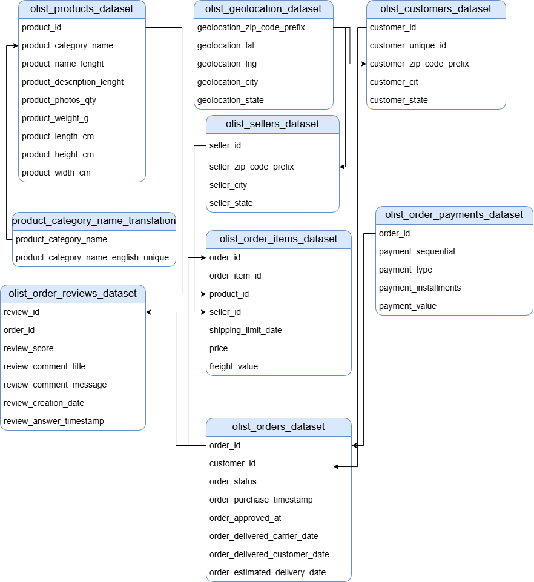
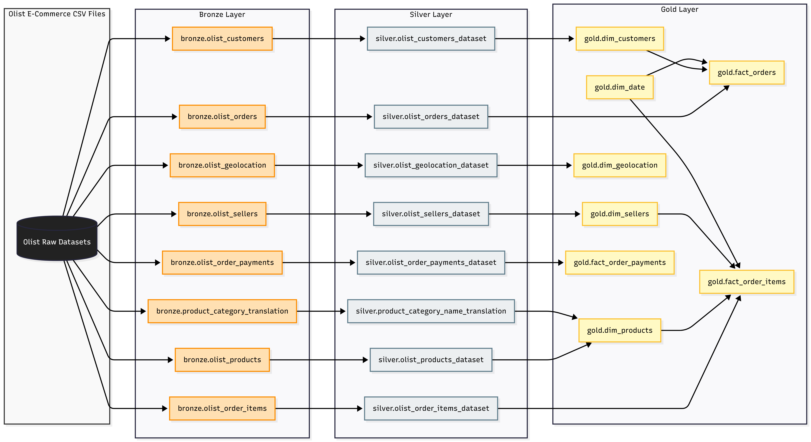

# Olist E-Commerce End-to-End Data Engineering & Warehouse Project

## 📌 Project Overview
This project delivers a robust, end-to-end Data Engineering solution utilizing the public **Brazilian E-Commerce Dataset by Olist**. The primary objective is to build a modern Data Warehouse following the **Medallion Architecture** (Bronze, Silver, Gold layers) using SQL and Python. 

By cleaning raw transactional records, dealing with character encoding challenges, and designing a highly optimized **Star Schema**, this architecture provides a solid, business-ready analytical layer optimized for reporting and Business Intelligence (BI) applications like Power BI.

---

## 🏗️ Architecture & Data Flow

The project layout leverages a modular pipeline approach to move data cleanly from its raw, source format into structured dimensional models.

### 1. Source Entity-Relationship Diagram (ERD)
Below is the relational structure of the raw datasets before any transformation or engineering pipelines were applied:



### 2. Medallion Data Lineage (Bronze ➔ Silver ➔ Gold)
This lineage tracking demonstrates how data shifts through our engineering stages, maintaining tracking from flat raw CSV formats down to final Facts and Dimensions in the Gold layer:



---

## 🗂️ Repository Structure

Based on standard DataOps and production-level engineering layouts:

```text
├── datasets/          # Documentation and links to raw data references
├── docs/              # Architecture diagrams, ERD, and assets
│   └── images/        # Images used in this README (source_erd.png, data_lineage.png)
├── scripts/           # SQL and Python DDL/DML transformation workflows
│   ├── bronze/        # Raw data ingestion & landing scripts
│   ├── silver/        # Data cleansing, encoding resolution, & deduplication
│   └── gold/          # Dimensional modeling (Star Schema, dim_date, fact tables)
└── README.md          # Main project documentation
